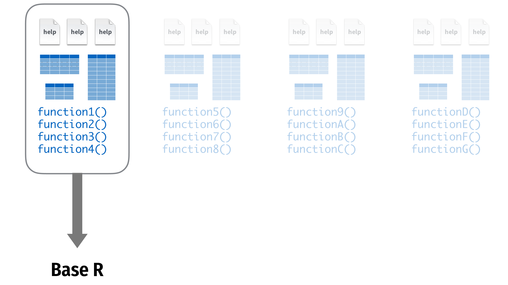
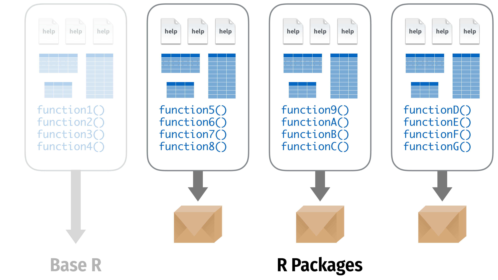
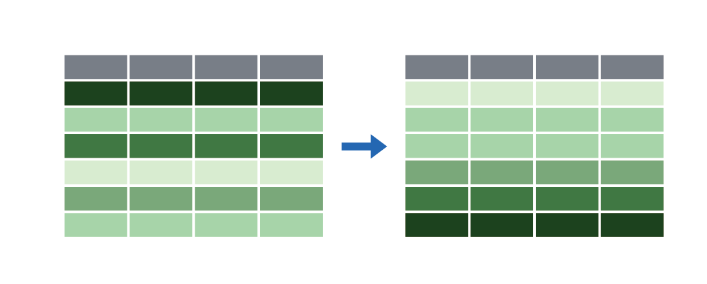

```{r setup, include=FALSE}
knitr::opts_chunk$set(warning = FALSE, message = FALSE, 
                      fig.retina = 3, fig.align = "center")
```

```{r packages-data, include=FALSE}
library(tidyverse)
library(gapminder)
library(ggthemes)
library(flair)
library(knitr)
library(kableExtra)
```

```{r xaringanExtra, echo=FALSE}
xaringanExtra::use_xaringan_extra(c("tile_view"))
```

class: center middle main-title section-title-7

# Overview of R<br>and the tidyverse

.class-info[

**Lab**

.light[PMAP 8521: Program evaluation<br>
Andrew Young School of Policy Studies
]

]

---

name: outline
class: title title-inv-8

# Plan for today

--

.box-6.medium.sp-after-half[Packages and data]

--

.box-1.medium.sp-after-half[Visualize data with ggplot2]

--

.box-2.medium.sp-after-half[Transform data with dplyr]

---

class: center middle main-title section-title-6

# Packages and data

---

<figure>
  
</figure>

---

<figure>
  
</figure>

---

class: title title-6

# Using packages

.pull-left[
```{r eval=FALSE}
install.packages("name")
```

.box-inv-6[Downloads files<br>to your computer]

.box-inv-6[Do this once per computer]
]

--

.pull-right[
```{r eval=FALSE}
library("name")
```

.box-inv-6[Loads the package]

.box-inv-6[Do this once per R session]
]

---

class: title title-6

# The tidyverse

.pull-left[
.box-inv-6.small["The tidyverse is an opinionated collection of R packages designed for data science. All packages share an underlying design philosophy, grammar, and data structures."]

.box-inv-6[… the tidyverse makes data science faster, easier and more fun…]
]

.pull-right[
<figure>
  
</figure>
]

---

class: title title-6

# The tidyverse

<figure>
  
</figure>

???

From "Master the Tidyverse" by RStudio

---

class: title title-6

# The tidyverse package

.center[
```{r eval=FALSE}
library(tidyverse)
```
]

.box-inv-6[The tidyverse package is a shortcut for<br>installing and loading all the key tidyverse packages]

---

.pull-left[
```{r eval=FALSE}
install.packages("tidyverse")
```

.tiny[
```{r eval=FALSE}
install.packages("ggplot2")
install.packages("dplyr")
install.packages("tidyr")
install.packages("readr")
install.packages("purrr")
install.packages("tibble")
install.packages("stringr")
install.packages("forcats")
install.packages("lubridate")
install.packages("hms")
install.packages("DBI")
install.packages("haven")
install.packages("httr")
install.packages("jsonlite")
install.packages("readxl")
install.packages("rvest")
install.packages("xml2")
install.packages("modelr")
install.packages("broom")
```
]
]

--

.pull-right[
```{r eval=FALSE}
library("tidyverse")
```

.tiny[
```{r eval=FALSE}
library("ggplot2")
library("dplyr")
library("tidyr")
library("readr")
library("purrr")
library("tibble")
library("stringr")
library("forcats")
```
]
]

---

class: title title-6

# Data frames and tibbles

.box-inv-6.medium[Data frames are the most common kind of data objects; used for rectangular data (like spreadsheets)]

--

.box-6[Data frames: R's native data object]

--

.box-6[Tibbles (`tbl`): a fancier enhanced kind of data frame]

--

.box-6.small[(You really won't notice a difference in this class)]

---

class: title title-6

# Vectors

.box-inv-6[Vectors are a list of values of the same time<br>(all text, or all numbers, etc.)]

.box-inv-6[Make them with `c()`:]

```{r eval=FALSE}
c(1, 4, 2, 5, 7)
```

--

.box-inv-6[You'll usually want to assign them to something:]

```{r eval=FALSE}
neat_numbers <- c(1, 4, 2, 5, 7)
```

---

class: title title-6

# Basic data types

<table>
  <tr>
    <td><b>Integer</b></td>
    <td>Whole numbers</td>
    <td><code class="remark-inline-code">c(1, 2, 3, 4)</code></td>
  </tr>
  <tr>
    <td><b>Double</b></td>
    <td>Numbers</td>
    <td><code class="remark-inline-code">c(1, 2.4, 3.14, 4)</code></td>
  </tr>
  <tr>
    <td><b>Character</b></td>
    <td>Text</td>
    <td><code class="remark-inline-code">c("1", "blue", "fun", "monster")</code></td>
  </tr>
  <tr>
    <td><b>Logical</b></td>
    <td>True or false</td>
    <td><code class="remark-inline-code">c(TRUE, FALSE, TRUE, FALSE)</code></td>
  </tr>
  <tr>
    <td><b>Factor</b></td>
    <td>Category</td>
    <td><code class="remark-inline-code">c("Strongly disagree", "Agree", "Neutral")</code></td>
  </tr>
</table>

---

class: title title-6

# Packages for importing data

<table>
  <tr>
    <td></td>
    <td>Work with plain text data</td>
    <td><code class="remark-inline-code">my_data <- read_csv("file.csv")</code></td>
  </tr>
  <tr>
    <td></td>
    <td>Work with Excel files</td>
    <td><code class="remark-inline-code">my_data <- read_excel("file.xlsx")</code></td>
  </tr>
  <tr>
    <td></td>
    <td>Work with Stata, SPSS, and SAS data</td>
    <td><code class="remark-inline-code">my_data <- read_stata("file.dta")</code></td>
  </tr>
</table>

---

class: center middle main-title section-title-1

# Visualize data<br>with ggplot2

.class-info[
<figure>
  
</figure>
]

---

```{r fig.width=6, fig.height=3.5, out.width="60%"}
ggplot(data = mpg) +
  geom_point(mapping = aes(x = displ, y = hwy))
```

---

class: bg-full bg-y-75
background-image: url("img/01/napoleon-retreat.jpg")

???

Source: [Wikipedia](https://en.wikipedia.org/wiki/File:National_Museum_in_Poznan_-_Przej%C5%9Bcie_przez_Berezyn%C4%99.JPG)

---

layout: true
class: title title-1

---

# Long distance!

.center[
<figure>
  
  <figcaption>Moscow to Vilnius</figcaption>
</figure>
]

---

# Very cold!

```{r minard-temps, echo=FALSE, warning=FALSE, fig.width=12, fig.height=6.5}
# https://github.com/vincentarelbundock/Rdatasets/tree/master/csv/HistData
minard_temps <- read_csv("data/Minard.temp.csv") %>% 
  uncount(days) %>% 
  mutate(day_index = 1:n())

ggplot(minard_temps, aes(x = day_index, y = temp)) +
  geom_line(color = "#4472C4", size = 3) + 
  labs(x = "Days since retreat from Moscow", y = "°C") +
  theme_gdocs(base_size = 30)
```

---

# Lots of people died!

```{r minard-deaths, echo=FALSE, fig.height=6.5, fig.width=6.5}
minard_deaths <- tribble(
  ~status, ~count,
  "Died", 422000,
  "Survived", 10000
)

ggplot(minard_deaths, aes(x = "", y = count, fill = status)) +
  geom_col() + 
  coord_polar(theta = "y") +
  scale_fill_manual(values = c("#FFC000", "#4472C4"), name = NULL) +
  labs(title = "Napoleon’s Grande Armée") +
  theme_void(base_family = "sans", base_size = 30) +
  theme(legend.position = "bottom")
```

---

layout: false
class: bg-full
background-image: url("img/01/minard.png")

???

Source: [Wikimedia Commons](https://upload.wikimedia.org/wikipedia/commons/2/29/Minard.png)

---

layout: true
class: title title-1

---

# Mapping data to aesthetics

.pull-left.center[

<figure>
  
</figure>

]

.pull-right[

.box-inv-1.medium[Aesthetic]

.box-1[Visual property of a graph]

.box-1.sp-after[Position, shape, color, etc.]

.box-inv-1.medium[Data]

.box-1[A column in a dataset]

]

---

# Mapping data to aesthetics

<table>
  <tr>
    <th class="cell-left">Data</th>
    <th class="cell-left">Aesthetic</th>
    <th class="cell-left">Graphic/Geometry</th>
  </tr>
  <tr>
    <td class="cell-left">Longitude</td>
    <td class="cell-left">Position (x-axis)&emsp;</td>
    <td class="cell-left">Point</td>
  </tr>
  <tr>
    <td class="cell-left">Latitude</td>
    <td class="cell-left">Position (y-axis)</td>
    <td class="cell-left">Point</td>
  </tr>
  <tr>
    <td class="cell-left">Army size</td>
    <td class="cell-left">Size</td>
    <td class="cell-left">Path</td>
  </tr>
  <tr>
    <td class="cell-left">Army direction&emsp;</td>
    <td class="cell-left">Color</td>
    <td class="cell-left">Path</td>
  </tr>
  <tr>
    <td class="cell-left">Date</td>
    <td class="cell-left">Position (x-axis)</td>
    <td class="cell-left">Line + text</td>
  </tr>
  <tr>
    <td class="cell-left">Temperature</td>
    <td class="cell-left">Position (y-axis)</td>
    <td class="cell-left">Line + text</td>
  </tr>
</table>

---

# Mapping data to aesthetics

<table>
  <tr>
    <th class="cell-left">Data</th>
    <th class="cell-left"><code class="remark-inline-code">aes()</code></th>
    <th class="cell-left"><code class="remark-inline-code">geom</code></th>
  </tr>
  <tr>
    <td class="cell-left">Longitude</td>
    <td class="cell-left"><code class="remark-inline-code">x</code></td>
    <td class="cell-left"><code class="remark-inline-code">geom_point()</code></td>
  </tr>
  <tr>
    <td class="cell-left">Latitude</td>
    <td class="cell-left"><code class="remark-inline-code">y</code></td>
    <td class="cell-left"><code class="remark-inline-code">geom_point()</code></td>
  </tr>
  <tr>
    <td class="cell-left">Army size</td>
    <td class="cell-left"><code class="remark-inline-code">size</code></td>
    <td class="cell-left"><code class="remark-inline-code">geom_path()</code></td>
  </tr>
  <tr>
    <td class="cell-left">Army direction&emsp;</td>
    <td class="cell-left"><code class="remark-inline-code">color</code>&emsp;</td>
    <td class="cell-left"><code class="remark-inline-code">geom_path()</code></td>
  </tr>
  <tr>
    <td class="cell-left">Date</td>
    <td class="cell-left"><code class="remark-inline-code">x</code></td>
    <td class="cell-left"><code class="remark-inline-code">geom_line() + geom_text()</code></td>
  </tr>
  <tr>
    <td class="cell-left">Temperature</td>
    <td class="cell-left"><code class="remark-inline-code">y</code></td>
    <td class="cell-left"><code class="remark-inline-code">geom_line() + geom_text()</code></td>
  </tr>
</table>

---

# `ggplot()` template

```{r show-ggplot-template, echo=FALSE, tidy=FALSE}
decorate('
ggplot(data = DATA) +
  GEOM_FUNCTION(mapping = aes(AESTHETIC MAPPINGS))
', eval = FALSE) %>% 
  flair("DATA", background = "#CBB5FF", before = "<b>", after = "</b>") %>% 
  flair("GEOM_FUNCTION", background = "#FFDFD1", before = "<b>", after = "</b>") %>% 
  flair("AESTHETIC MAPPINGS", background = "#FFD0CF", before = "<b>", after = "</b>")
```

--

```{r ggplot-template-example, echo=FALSE}
decorate('
ggplot(data = troops) +
  geom_path(mapping = aes(x = longitude,
                          y = latitude,
                          color = direction,
                          size = survivors))
', eval = FALSE) %>%
  flair("troops", background = "#CBB5FF", before = "<b>", after = "</b>") %>% 
  flair("geom_path", background = "#FFDFD1", before = "<b>", after = "</b>") %>% 
  flair_rx("x = longitude|y = latitude|color = direction|size = survivors", 
           background = "#FFD0CF", before = "<b>", after = "</b>")
```

---

layout: false

```{r minard-troops, echo=FALSE, warning=FALSE}
# https://github.com/vincentarelbundock/Rdatasets/tree/master/csv/HistData
troops <- read_csv("data/Minard.troops.csv") %>% 
  select(longitude = long, latitude = lat, direction, survivors)
```

.box-1[This is a dataset named `troops`:]

.small[

```{r head-troops, echo=FALSE}
troops %>% 
  slice(1:2) %>% 
  mutate_all(as.character) %>% 
  bind_rows(tibble(longitude = "…", latitude = "…", direction = "…", survivors = "…")) %>% 
  knitr::kable(format = "html")
```

]

--

```{r ggplot-template-example1, echo=FALSE}
decorate('
ggplot(data = troops) +
  geom_path(mapping = aes(x = longitude,
                          y = latitude,
                          color = direction,
                          size = survivors))
', eval = FALSE) %>%
  flair("troops", background = "#CBB5FF", before = "<b>", after = "</b>") %>% 
  flair("geom_path", background = "#FFDFD1", before = "<b>", after = "</b>") %>% 
  flair_rx("x = longitude|y = latitude|color = direction|size = survivors", 
           background = "#FFD0CF", before = "<b>", after = "</b>")
```

---

```{r show-basic-minard, echo=FALSE, fig.width=16, fig.height=8, out.width="100%"}
ggplot(data = troops,
       mapping = aes(x = longitude,
                     y = latitude,
                     color = direction,
                     size = survivors)) +
  geom_path(lineend = "round", linejoin = "mitre") + 
  scale_size_continuous(range = c(1, 20),
                        labels = scales::comma) +
  theme_gray(base_size = 20)
```

---

```{r fig.width=6, fig.height=3.5, out.width="60%"}
ggplot(data = mpg) +
  geom_point(mapping = aes(x = displ, y = hwy))
```

---

layout: true
class: title title-1

---

# Heavy cars with better mileage?

```{r echo=FALSE, fig.width=6, fig.height=3.5, out.width="60%"}
ggplot(data = mpg) +
  geom_point(mapping = aes(x = displ, y = hwy))
```

---

# Aesthetics

.pull-left-3[

.box-inv-1.small[`color` (discrete)]

```{r aes-color-discrete, echo=FALSE, fig.dim=c(4, 2), out.width="100%"}
eg <- tribble(
  ~x, ~y, ~size, ~x1,
  "A", 1, 5, 1,
  "B", 1, 10, 2,
  "C", 1, 15, 3
)

# Color, discrete
ggplot(eg, aes(x = x, y = y, color = x)) +
  geom_point(size = 30) +
  guides(color = FALSE) +
  theme(axis.text.y = element_blank(),
        axis.ticks = element_blank())
```

.box-inv-1.small[`color` (continuous)]

```{r aes-color-continuous, echo=FALSE, fig.dim=c(4, 2), out.width="100%"}
# Color, continuous
ggplot(eg, aes(x = x1, y = y, color = x1)) +
  geom_point(size = 30) +
  guides(color = FALSE) +
  coord_cartesian(xlim = c(0.5, 3.5)) +
  theme(axis.text.y = element_blank(),
        axis.ticks = element_blank())
```
]

.pull-middle-3[

.box-inv-1.small[`size`]

```{r aes-size, echo=FALSE, fig.dim=c(4, 2), out.width="100%"}
# Size
ggplot(eg, aes(x = x, y = y, size = x)) +
  geom_point() +
  scale_size_discrete(range = c(2, 30)) +
  guides(size = FALSE) +
  theme(axis.text.y = element_blank(),
        axis.ticks = element_blank())
```

.box-inv-1.small[`fill`]

```{r aes-fill, echo=FALSE, fig.dim=c(4, 2), out.width="100%"}
# Fill
ggplot(eg, aes(x = x, y = y, fill = x)) +
  geom_point(size = 30, pch = 21, stroke = 5) +
  guides(fill = FALSE) +
  theme(axis.text.y = element_blank(),
        axis.ticks = element_blank())
```
]

.pull-right-3[

.box-inv-1.small[`shape`]

```{r aes-shape, echo=FALSE, fig.dim=c(4, 2), out.width="100%"}
# Shape
ggplot(eg, aes(x = x, y = y, shape = x)) +
  geom_point(size = 30) +
  guides(shape = FALSE) +
  theme(axis.text.y = element_blank(),
        axis.ticks = element_blank())
```

.box-inv-1.small[`alpha`]

```{r aes-alpha, echo=FALSE, fig.dim=c(4, 2), out.width="100%"}
# Alpha
ggplot(eg, aes(x = x, y = y, alpha = x)) +
  geom_point(size = 30) +
  guides(alpha = FALSE) +
  theme(axis.text.y = element_blank(),
        axis.ticks = element_blank())
```
]

---

# Mapping columns to aesthetics

.small[
```{r eval=FALSE}
ggplot(mpg) + geom_point(aes(x = displ, y = hwy, color = class))
ggplot(mpg) + geom_point(aes(x = displ, y = hwy, size = class))
ggplot(mpg) + geom_point(aes(x = displ, y = hwy, shape = class))
ggplot(mpg) + geom_point(aes(x = displ, y = hwy, alpha = class))
```
]

---

layout: false

```{r fig.width=6, fig.height=3.5, out.width="60%"}
ggplot(data = mpg) +
  geom_point(mapping = aes(x = displ, y = hwy, color = class))
```

---

class: title title-1 section-title-inv-1

# ggplot playground

.box-1[Add color, size, alpha, and shape aesthetics to your graph.]

.box-1[Experiment!]

.box-1[Do different things happen when you map aesthetics to discrete and continuous variables?]

.box-1[What happens when you use more than one aesthetic?]

---

class: title title-1

# How would you make this plot?

```{r echo=FALSE, fig.width=6, fig.height=3.5, out.width="70%"}
ggplot(data = mpg) +
  geom_point(mapping = aes(x = displ, y = hwy), color = "blue")
```

---

.left-code[
```{r color-aes-example, tidy=FALSE, message=FALSE, fig.show="hide", fig.dim=c(4.8, 3.75), out.width="100%"}
ggplot(mpg) +
  geom_point(aes(x = displ, y = hwy, 
                 color = class))
```
]

.right-plot[
`)
]

---

.left-code[
```{r color-set-example, tidy=FALSE, message=FALSE, fig.show="hide", fig.dim=c(4.8, 3.75), out.width="100%"}
ggplot(mpg) +
  geom_point(aes(x = displ, y = hwy), 
             color = "blue")
```
]

.right-plot[
`)
]

---

.pull-left[
.small[
```{r tidy=FALSE, message=FALSE, fig.dim=c(4.8, 3.75), out.width="100%"}
ggplot(mpg) +
  geom_point(aes(x = displ, y = hwy, 
                 color = "blue"))
```
]
]

.pull-right[
.small[
```{r tidy=FALSE, message=FALSE, fig.dim=c(4.8, 3.75), out.width="100%"}
ggplot(mpg) +
  geom_point(aes(x = displ, y = hwy), 
             color = "blue")
```
]
]

---

layout: true
class: title title-1

---

# What's the same? What's different?

.pull-left[
```{r echo=FALSE, tidy=FALSE, message=FALSE, fig.dim=c(4.8, 3.75), out.width="100%"}
ggplot(mpg) +
  geom_point(aes(x = displ, y = hwy))
```
]

.pull-right[
```{r echo=FALSE, tidy=FALSE, message=FALSE, fig.dim=c(4.8, 3.75), out.width="100%"}
ggplot(mpg) +
  geom_smooth(aes(x = displ, y = hwy))
```
]

---

# Geoms

```{r show-ggplot-template1, echo=FALSE, tidy=FALSE}
decorate('
ggplot(data = DATA) +
  GEOM_FUNCTION(mapping = aes(AESTHETIC MAPPINGS))
', eval = FALSE) %>% 
  flair("DATA", background = "#CBB5FF", before = "<b>", after = "</b>") %>% 
  flair("GEOM_FUNCTION", background = "#FFDFD1", before = "<b>", after = "</b>") %>% 
  flair("AESTHETIC MAPPINGS", background = "#FFD0CF", before = "<b>", after = "</b>")
```

---

# Possible geoms

<table>
  <tr>
    <th class="cell-left"></th>
    <th class="cell-left">Example geom</th>
    <th class="cell-left">What it makes</th>
  </tr>
  <tr>
    <td class="cell-left"></td>
    <td class="cell-left"><code class="remark-inline-code">geom_col()</code></td>
    <td class="cell-left">Bar charts</td>
  </tr>
  <tr>
    <td class="cell-left"></td>
    <td class="cell-left"><code class="remark-inline-code">geom_text()</code></td>
    <td class="cell-left">Text</td>
  </tr>
  <tr>
    <td class="cell-left"></td>
    <td class="cell-left"><code class="remark-inline-code">geom_point()</code></td>
    <td class="cell-left">Points</td>
  </tr>
  <tr>
    <td class="cell-left"></td>
    <td class="cell-left"><code class="remark-inline-code">geom_boxplot()</code>&emsp;</td>
    <td class="cell-left">Boxplots</td>
  </tr>
  <tr>
    <td class="cell-left"></td>
    <td class="cell-left"><code class="remark-inline-code">geom_sf()</code></td>
    <td class="cell-left">Maps</td>
  </tr>
</table>

---

# Possible geoms

.box-inv-1[There are dozens of possible geoms!]

.box-1[See [the **ggplot2** documentation](https://ggplot2.tidyverse.org/reference/index.html#section-layer-geoms) for<br>complete examples of all the different geom layers]

.box-1[Also see the ggplot cheatsheet]

---

class: title title-1

# Complex graphs!

```{r eval=FALSE}
ggplot(data = mpg) +
  geom_point(mapping = aes(x = displ, y = hwy)) +
  geom_smooth(mapping = aes(x = displ, y = hwy))
```

---

class: title title-1

# Complex graphs!

```{r echo=FALSE, fig.width=6, fig.height=3.5, out.width="70%"}
ggplot(data = mpg) +
  geom_point(mapping = aes(x = displ, y = hwy)) +
  geom_smooth(mapping = aes(x = displ, y = hwy))
```

---

class: title title-1

# Global vs. local

.box-inv-1[Any aesthetics in `ggplot()` will show up in all `geom_` layers]

.small[
```{r fig.width=6, fig.height=2.5, out.width="60%"}
ggplot(data = mpg, mapping = aes(x = displ, y = hwy)) +
  geom_point() +
  geom_smooth()
```
]

---

class: title title-1

# Global vs. local

.box-inv-1[Any aesthetics in `geom_` layers only apply to that layer]

.small[
```{r fig.width=6, fig.height=2.5, out.width="60%"}
ggplot(data = mpg, mapping = aes(x = displ, y = hwy)) +
  geom_point(mapping = aes(color = drv)) +
  geom_smooth()
```
]

---

layout: true
class: title title-1

---

# So much more!

.pull-left[
.box-inv-1[There are many other layers we can use to make and enhance graphs!]

.box-inv-1[We sequentially add layers onto the foundational `ggplot()` plot to create complex figures]
]

.pull-right[

]

---

# Putting it all together

.box-inv-1.medium[We can build a plot sequentially<br>to see how each grammatical layer<br>changes the appearance]

---

layout: false

.left-code[
.box-1[Start with data and aesthetics]

```{r mpg-layers-1, tidy=FALSE, message=FALSE, fig.show="hide", fig.dim=c(4.8, 5), out.width="100%"}
ggplot(data = mpg,                  #<<
       mapping = aes(x = displ,     #<<
                     y = hwy,       #<<
                     color = drv))  #<<
```
]

.right-plot[
`)
]

---

.left-code[
.box-1[Add a point geom]

```{r mpg-layers-2, tidy=FALSE, message=FALSE, fig.show="hide", fig.dim=c(4.8, 5), out.width="100%"}
ggplot(data = mpg,
       mapping = aes(x = displ,
                     y = hwy,
                     color = drv)) +
  geom_point() #<<
```
]

.right-plot[
`)
]

---

.left-code[
.box-1[Add a smooth geom]

```{r mpg-layers-3, tidy=FALSE, message=FALSE, fig.show="hide", fig.dim=c(4.8, 5), out.width="100%"}
ggplot(data = mpg,
       mapping = aes(x = displ,
                     y = hwy,
                     color = drv)) +
  geom_point() +
  geom_smooth() #<<
```
]

.right-plot[
`)
]

---

.left-code[
.box-1[Make it straight]

```{r mpg-layers-4, tidy=FALSE, message=FALSE, fig.show="hide", fig.dim=c(4.8, 5), out.width="100%"}
ggplot(data = mpg,
       mapping = aes(x = displ,
                     y = hwy,
                     color = drv)) +
  geom_point() +
  geom_smooth(method = "lm") #<<
```
]

.right-plot[
`)
]

---

.left-code[
.box-1[Use a viridis color scale]

```{r mpg-layers-5, tidy=FALSE, message=FALSE, fig.show="hide", fig.dim=c(4.8, 5), out.width="100%"}
ggplot(data = mpg,
       mapping = aes(x = displ,
                     y = hwy,
                     color = drv)) +
  geom_point() +
  geom_smooth(method = "lm") +
  scale_color_viridis_d() #<<
```
]

.right-plot[
`)
]

---

.left-code[
.box-1[Facet by drive]

```{r mpg-layers-6, tidy=FALSE, message=FALSE, fig.show="hide", fig.dim=c(4.8, 5), out.width="100%"}
ggplot(data = mpg,
       mapping = aes(x = displ,
                     y = hwy,
                     color = drv)) +
  geom_point() +
  geom_smooth(method = "lm") +
  scale_color_viridis_d() +
  facet_wrap(vars(drv), ncol = 1) #<<
```
]

.right-plot[
`)
]

---

.left-code[
.box-1[Add labels]

```{r mpg-layers-7, tidy=FALSE, message=FALSE, fig.show="hide", fig.dim=c(4.8, 5), out.width="100%"}
ggplot(data = mpg,
       mapping = aes(x = displ,
                     y = hwy,
                     color = drv)) +
  geom_point() +
  geom_smooth(method = "lm") +
  scale_color_viridis_d() +
  facet_wrap(vars(drv), ncol = 1) +
  labs(x = "Displacement", y = "Highway MPG",  #<<
       color = "Drive",   #<<
       title = "Heavier cars get lower mileage",  #<<
       subtitle = "Displacement indicates weight(?)",  #<<
       caption = "I know nothing about cars")  #<<
```
]

.right-plot[
`)
]

---

.left-code[
.box-1[Add a theme]

```{r mpg-layers-8, tidy=FALSE, message=FALSE, fig.show="hide", fig.dim=c(4.8, 5), out.width="100%"}
ggplot(data = mpg,
       mapping = aes(x = displ,
                     y = hwy,
                     color = drv)) +
  geom_point() +
  geom_smooth(method = "lm") +
  scale_color_viridis_d() +
  facet_wrap(vars(drv), ncol = 1) +
  labs(x = "Displacement", y = "Highway MPG",
       color = "Drive", 
       title = "Heavier cars get lower mileage",
       subtitle = "Displacement indicates weight(?)",
       caption = "I know nothing about cars") +
  theme_bw() #<<
```
]

.right-plot[
`)
]

---

.left-code[
.box-1[Modify the theme]

```{r mpg-layers-9, tidy=FALSE, message=FALSE, fig.show="hide", fig.dim=c(4.8, 5), out.width="100%"}
ggplot(data = mpg, 
       mapping = aes(x = displ,
                     y = hwy,
                     color = drv)) +
  geom_point() +
  geom_smooth(method = "lm") +
  scale_color_viridis_d() +
  facet_wrap(vars(drv), ncol = 1) +
  labs(x = "Displacement", y = "Highway MPG",
       color = "Drive", 
       title = "Heavier cars get lower mileage",
       subtitle = "Displacement indicates weight(?)",
       caption = "I know nothing about cars") +
  theme_bw() +
  theme(legend.position = "bottom", #<<
        plot.title = element_text(face = "bold")) #<<
```
]

.right-plot[
`)
]

---

.left-code[
.box-1[Finished!]

```{r mpg-layers-finished, tidy=FALSE, message=FALSE, fig.show="hide", fig.dim=c(4.8, 5), out.width="100%"}
ggplot(data = mpg, 
       mapping = aes(x = displ,
                     y = hwy,
                     color = drv)) +
  geom_point() +
  geom_smooth(method = "lm") + 
  scale_color_viridis_d() +
  facet_wrap(vars(drv), ncol = 1) +
  labs(x = "Displacement", y = "Highway MPG",
       color = "Drive", 
       title = "Heavier cars get lower mileage",
       subtitle = "Displacement indicates weight(?)",
       caption = "I know nothing about cars") +
  theme_bw() +
  theme(legend.position = "bottom",
        plot.title = element_text(face = "bold"))
```
]

.right-plot[
`)
]

---

class: center middle main-title section-title-2

# Transform data<br>with dplyr

.class-info[
<figure>
  
</figure>
]

---

.small[
```{r show-gapminder}
gapminder
```
]

---

class: title title-2

# The tidyverse

<figure>
  
</figure>

???

From "Master the Tidyverse" by RStudio

---

class: title title-2

# The tidyverse

.center[
<figure>
  
</figure>
]

---

class: title title-2

# dplyr: verbs for manipulating data

<table>
  <tr>
    <td>Extract rows with <code>filter()</code></td>
    <td></td>
  </tr>
  <tr>
    <td>Extract columns with <code>select()</code></td>
    <td></td>
  </tr>
  <tr>
    <td>Arrange/sort rows with <code>arrange()</code></td>
    <td></td>
  </tr>
  <tr>
    <td>Make new columns with <code>mutate()</code></td>
    <td></td>
  </tr>
  <tr>
    <td>Make group summaries with<br><code>group_by() %>% summarize()</code></td>
    <td></td>
  </tr>
</table>

---

class: center middle section-title section-title-2

# `filter()`

---

layout: false
class: title title-2

# `filter()`

.box-inv-2[Extract rows that meet some sort of test]

.pull-left[
```{r show-filter-template, echo=FALSE, tidy=FALSE}
decorate('
filter(.data = DATA, ...)
', eval = FALSE) %>% 
  flair("DATA", background = "#FFDFD1", before = "<b>", after = "</b>") %>% 
  flair("...", background = "#FFD0CF", before = "<b>", after = "</b>")
```
]

.pull-right[
- <b><span style="background: #FFDFD1">`DATA`</span></b> = Data frame to transform
- <b><span style="background: #FFD0CF">`...`</span></b> = One or more tests <br>.small[`filter()` returns each row for which the test is TRUE]
]

---

```{r echo=FALSE, tidy=FALSE}
decorate('
filter(.data = gapminder, country == "Denmark")
', eval = FALSE) %>% 
  flair("gapminder", background = "#FFDFD1", before = "<b>", after = "</b>") %>% 
  flair('country == "Denmark"', background = "#FFD0CF", before = "<b>", after = "</b>")
```

.pull-left[
```{r echo=FALSE}
gapminder %>% 
  select(country, continent, year) %>% 
  head(5) %>% 
  mutate(year = as.character(year)) %>% 
  bind_rows(tibble(country = "…", continent = "…", year = "…")) %>% 
  knitr::kable(format = "html")
```
]

--

.pull-right[
```{r echo=FALSE}
gapminder %>% 
  select(country, continent, year) %>% 
  filter(country == "Denmark") %>% 
  head(6) %>% 
  knitr::kable(format = "html")
```
]

---

class: title title-2

# `filter()`

.pull-left[
```{r echo=FALSE, tidy=FALSE}
decorate('
filter(.data = gapminder, 
       country == "Denmark")
', eval = FALSE) %>% 
  flair("gapminder", background = "#FFDFD1", before = "<b>", after = "</b>") %>% 
  flair('country == "Denmark"', background = "#FFD0CF", before = "<b>", after = "</b>")
```
]

.pull-right[
.box-inv-2[One `=` sets an argument]

.box-inv-2[Two `==` tests if equal<br>.small[returns TRUE or FALSE)]]
]

---

class: title title-2

# Logical tests

<table>
  <tr>
    <th class="cell-center">Test</th>
    <th class="cell-left">Meaning</th>
    <th class="cell-center">Test</th>
    <th class="cell-left">Meaning</th>
  </tr>
  <tr>
    <td class="cell-center"><code class="remark-inline-code">x < y</code></td>
    <td class="cell-left">Less than</td>
    <td class="cell-center"><code class="remark-inline-code">x %in% y</code></td>
    <td class="cell-left">In (group membership)</td>
  </tr>
  <tr>
    <td class="cell-center"><code class="remark-inline-code">x > y</code></td>
    <td class="cell-left">Greater than</td>
    <td class="cell-center"><code class="remark-inline-code">is.na(x)</code></td>
    <td class="cell-left">Is missing</td>
  </tr>
  <tr>
    <td class="cell-center"><code class="remark-inline-code">==</code></td>
    <td class="cell-left">Equal to</td>
    <td class="cell-center"><code class="remark-inline-code">!is.na(x)</code></td>
    <td class="cell-left">Is not missing</td>
  </tr>
  <tr>
    <td class="cell-center"><code class="remark-inline-code">x <= y</code></td>
    <td class="cell-left">Less than or equal to</td>
  </tr>
  <tr>
    <td class="cell-center"><code class="remark-inline-code">x >= y</code></td>
    <td class="cell-left">Greater than or equal to</td>
  </tr>
  <tr>
    <td class="cell-center"><code class="remark-inline-code">x != y</code></td>
    <td class="cell-left">Not equal to</td>
  </tr>
</table>

---

class: title title-2 section-title-inv-2

# Your turn #1: Filtering

.box-2[Use `filter()` and logical tests to show…]

1. The data for Canada
2. All data for countries in Oceania
3. Rows where the life expectancy is greater than 82

---

.medium[
```{r eval=FALSE}
filter(gapminder, country == "Canada")
```
]

--

.medium[
```{r eval=FALSE}
filter(gapminder, continent == "Oceania")
```
]

--

.medium[
```{r eval=FALSE}
filter(gapminder, lifeExp > 82)
```
]

---

class: title title-2

# Common mistakes

.pull-left[
.box-inv-2[Using `=` instead of `==`]

```{r echo=FALSE, tidy=FALSE}
decorate('
filter(gapminder, 
       country = "Canada")
', eval = FALSE) %>% 
  flair("=", color = "#FF4136", before = "<b>", after = "</b>")
```

```{r echo=FALSE, tidy=FALSE}
decorate('
filter(gapminder, 
       country == "Canada")
', eval = FALSE) %>% 
  flair("==", color = "#2ECC40", before = "<b>", after = "</b>")
```
]

--

.pull-right[
.box-inv-2[Quote use]

```{r echo=FALSE, tidy=FALSE}
decorate('
filter(gapminder, 
       country == Canada)
', eval = FALSE) %>% 
  flair("Canada", color = "#FF4136", before = "<b>", after = "</b>")
```

```{r echo=FALSE, tidy=FALSE}
decorate('
filter(gapminder, 
       country == "Canada")
', eval = FALSE) %>% 
  flair('"Canada"', color = "#2ECC40", before = "<b>", after = "</b>")
```
]

---

class: title title-2

# `filter()` with multiple conditions

.box-inv-2[Extract rows that meet *every* test]

```{r echo=FALSE, tidy=FALSE}
decorate('
filter(gapminder, country == "Denmark", year > 2000)
', eval = FALSE) %>% 
  flair("gapminder", background = "#FFDFD1", before = "<b>", after = "</b>") %>% 
  flair('country == "Denmark", year > 2000', background = "#FFD0CF", before = "<b>", after = "</b>")
```

---

```{r echo=FALSE, tidy=FALSE}
decorate('
filter(gapminder, country == "Denmark", year > 2000)
', eval = FALSE) %>% 
  flair("gapminder", background = "#FFDFD1", before = "<b>", after = "</b>") %>% 
  flair('country == "Denmark", year > 2000', background = "#FFD0CF", before = "<b>", after = "</b>")
```

.pull-left[
```{r echo=FALSE}
gapminder %>% 
  select(country, continent, year) %>% 
  head(5) %>% 
  mutate(year = as.character(year)) %>% 
  bind_rows(tibble(country = "…", continent = "…", year = "…")) %>% 
  knitr::kable(format = "html")
```
]

--

.pull-right[
```{r echo=FALSE}
gapminder %>% 
  select(country, continent, year) %>% 
  filter(country == "Denmark", year > 2000) %>% 
  head(6) %>% 
  knitr::kable(format = "html")
```
]

---

class: title title-2

# Boolean operators

<table>
  <tr>
    <th class="cell-center">Operator</th>
    <th class="cell-center">Meaning</th>
  </tr>
  <tr>
    <td class="cell-center"><code class="remark-inline-code">a & b</code></td>
    <td class="cell-center">and</td>
  </tr>
  <tr>
    <td class="cell-center"><code class="remark-inline-code">a | b</code></td>
    <td class="cell-center">or</td>
  </tr>
  <tr>
    <td class="cell-center"><code class="remark-inline-code">!a</code></td>
    <td class="cell-center">not</td>
  </tr>
</table>

---

class: title title-2

# Default is "and"

.box-inv-2[These do the same thing:]

```{r echo=FALSE, tidy=FALSE}
decorate('
filter(gapminder, country == "Denmark", year > 2000)
', eval = FALSE) %>% 
  flair("gapminder", background = "#FFDFD1", before = "<b>", after = "</b>") %>% 
  flair('country == "Denmark", year > 2000', background = "#FFD0CF", before = "<b>", after = "</b>")
```

```{r echo=FALSE, tidy=FALSE}
decorate('
filter(gapminder, country == "Denmark" & year > 2000)
', eval = FALSE) %>% 
  flair("gapminder", background = "#FFDFD1", before = "<b>", after = "</b>") %>% 
  flair('country == "Denmark" & year > 2000', background = "#FFD0CF", before = "<b>", after = "</b>")
```

---

class: title title-2 section-title-inv-2

# Your turn #2: Filtering

.box-2[Use `filter()` and Boolean logical tests to show…]

1. Canada before 1970
2. Countries where life expectancy in 2007 is below 50
3. Countries where life expectancy in 2007 is below 50 and are not in Africa

---

```{r eval=FALSE}
filter(gapminder, country == "Canada", year < 1970)
```

--

```{r eval=FALSE}
filter(gapminder, year == 2007, lifeExp < 50)
```

--

```{r eval=FALSE}
filter(gapminder, year == 2007, lifeExp < 50, 
       continent != "Africa")
```

---

class: title title-2

# Common mistakes

.pull-left[
.box-inv-2[Collapsing multiple tests<br>into one]

.small-code[
```{r echo=FALSE, tidy=FALSE}
decorate('
filter(gapminder, 1960 &lt; year &lt; 1980)
', eval = FALSE) %>% 
  flair("1960 &lt; year &lt; 1980", color = "#FF4136", before = "<b>", after = "</b>")
```
]

.small-code[
```{r echo=FALSE, tidy=FALSE}
decorate('
filter(gapminder, 
       year > 1960, year &lt; 1980)
', eval = FALSE) %>% 
  flair("year > 1960, year &lt; 1980", color = "#2ECC40", before = "<b>", after = "</b>")
```
]
]

--

.pull-right[
.box-inv-2[Using multiple tests<br>instead of `%in%`]

.small-code[
```{r echo=FALSE, tidy=FALSE}
decorate('
filter(gapminder, 
       country == "Mexico", 
       country == "Canada", 
       country == "United States")
', eval = FALSE) %>% 
  flair('country == "Mexico", 
       country == "Canada", 
       country == "United States"', color = "#FF4136", before = "<b>", after = "</b>")
```
]

.small-code[
```{r echo=FALSE, tidy=FALSE}
decorate('
filter(gapminder, 
       country %in% c("Mexico", "Canada", 
                      "United States"))
', eval = FALSE) %>% 
  flair('country %in% c("Mexico", "Canada", 
                      "United States")', color = "#2ECC40", before = "<b>", after = "</b>")
```
]
]

---

class: title title-2

# Common syntax

.box-inv-2[Every dplyr verb function follows the same pattern]

.box-inv-2[First argument is a data frame; returns a data frame]

.pull-left[
```{r echo=FALSE, tidy=FALSE}
decorate('
VERB(DATA, ...)
', eval = FALSE) %>% 
  flair("VERB", background = "#EFB3FF", before = "<b>", after = "</b>") %>% 
  flair("DATA", background = "#FFDFD1", before = "<b>", after = "</b>") %>% 
  flair("...", background = "#FFD0CF", before = "<b>", after = "</b>")
```
]

.pull-right[
- <b><span style="background: #EFB3FF">`VERB`</span></b> = dplyr function/verb
- <b><span style="background: #FFDFD1">`DATA`</span></b> = Data frame to transform
- <b><span style="background: #FFD0CF">`...`</span></b> = Stuff the verb does
]

---

class: title title-2

# `mutate()`

.box-inv-2[Create new columns]

.pull-left[
```{r echo=FALSE, tidy=FALSE}
decorate('
mutate(.data, ...)
', eval = FALSE) %>% 
  flair(".data", background = "#FFDFD1", before = "<b>", after = "</b>") %>% 
  flair("...", background = "#FFD0CF", before = "<b>", after = "</b>")
```
]

.pull-right[
- <b><span style="background: #FFDFD1">`DATA`</span></b> = Data frame to transform
- <b><span style="background: #FFD0CF">`...`</span></b> = Columns to make
]

---

```{r echo=FALSE, tidy=FALSE}
decorate('
mutate(gapminder, gdp = gdpPercap * pop)
', eval = FALSE) %>% 
  flair("gapminder", background = "#FFDFD1", before = "<b>", after = "</b>") %>% 
  flair('gdp = gdpPercap * pop', background = "#FFD0CF", before = "<b>", after = "</b>")
```

.pull-left.small[
```{r echo=FALSE}
gapminder %>% 
  select(country, year, gdpPercap, pop) %>% 
  head(5) %>% 
  mutate_at(vars(year, gdpPercap, pop), ~as.character(.)) %>% 
  bind_rows(tibble(country = "…", year = "…", gdpPercap = "…", pop = "…")) %>% 
  knitr::kable(format = "html")
```
]

--

.pull-right.small[
```{r echo=FALSE}
gapminder %>% 
  mutate(gdp = gdpPercap * pop) %>% 
  mutate(`…` = "…") %>% 
  select(country, year, `…`, gdp) %>% 
  head(6) %>% 
  knitr::kable(format = "html")
```
]

---

```{r echo=FALSE, tidy=FALSE}
decorate('
mutate(gapminder, gdp = gdpPercap * pop,
                  pop_mil = round(pop / 1000000))
', eval = FALSE) %>% 
  flair("gapminder", background = "#FFDFD1", before = "<b>", after = "</b>") %>% 
  flair('gdp = gdpPercap * pop,', background = "#FFD0CF", before = "<b>", after = "</b>") %>% 
  flair('pop_mil = round(pop / 1000000)', background = "#FFD0CF", before = "<b>", after = "</b>")
```

.pull-left.small[
```{r echo=FALSE}
gapminder %>% 
  select(country, year, gdpPercap, pop) %>% 
  head(5) %>% 
  mutate_at(vars(year, gdpPercap, pop), ~as.character(.)) %>% 
  bind_rows(tibble(country = "…", year = "…", gdpPercap = "…", pop = "…")) %>% 
  knitr::kable(format = "html")
```
]

--

.pull-right.small[
```{r echo=FALSE}
gapminder %>% 
  mutate(gdp = gdpPercap * pop,
         pop_mil = round(pop / 1000000)) %>% 
  mutate(`…` = "…") %>% 
  select(country, year, `…`, gdp, pop_mil) %>% 
  head(6) %>% 
  knitr::kable(format = "html")
```
]

---

class: title title-2

# `ifelse()`

.box-inv-2[Do conditional tests within `mutate()`]

.pull-left[
```{r echo=FALSE, tidy=FALSE}
decorate('
ifelse(TEST, 
       VALUE_IF_TRUE, 
       VALUE_IF_FALSE)
', eval = FALSE) %>% 
  flair("TEST", background = "#FFC0DC", before = "<b>", after = "</b>") %>% 
  flair("VALUE_IF_TRUE", background = "#FFDFD1", before = "<b>", after = "</b>") %>% 
  flair("VALUE_IF_FALSE", background = "#CBB5FF", before = "<b>", after = "</b>")
```
]

.pull-right[
- <b><span style="background: #FFC0DC">`TEST`</span></b> = A logical test
- <b><span style="background: #FFDFD1">`VALUE_IF_TRUE`</span></b> = What happens if test is true
- <b><span style="background: #CBB5FF">`VALUE_IF_FALSE`</span></b> = What happens if test is false
]

---

```{r echo=FALSE, tidy=FALSE}
decorate('
mutate(gapminder, 
       after_1960 = ifelse(year > 1960, TRUE, FALSE))
', eval = FALSE) %>% 
  flair("year > 1960", background = "#FFC0DC", before = "<b>", after = "</b>") %>% 
  flair("TRUE", background = "#FFDFD1", before = "<b>", after = "</b>") %>% 
  flair("FALSE", background = "#CBB5FF", before = "<b>", after = "</b>")
```

```{r echo=FALSE, tidy=FALSE}
decorate('
mutate(gapminder, 
       after_1960 = ifelse(year > 1960, 
                           "After 1960", 
                           "Before 1960"))
', eval = FALSE) %>% 
  flair("year > 1960", background = "#FFC0DC", before = "<b>", after = "</b>") %>% 
  flair('"After 1960"', background = "#FFDFD1", before = "<b>", after = "</b>") %>% 
  flair('"Before 1960"', background = "#CBB5FF", before = "<b>", after = "</b>")
```

---

class: title title-2 section-title-inv-2

# Your turn #3: Mutating

.box-2[Use `mutate()` to…]

1. Add an `africa` column that is TRUE if the country is on the African continent
2. Add a column for logged GDP per capita (hint: use `log()`)
3. Add an `africa_asia` column that says “Africa or Asia” if the country is in Africa or Asia, and “Not Africa or Asia” if it’s not

---

```{r eval=FALSE}
mutate(gapminder, africa = ifelse(continent == "Africa", 
                                  TRUE, FALSE))
```

--

```{r eval=FALSE}
mutate(gapminder, log_gdpPercap = log(gdpPercap))
```

--

```{r eval=FALSE}
mutate(gapminder, 
       africa_asia = 
         ifelse(continent %in% c("Africa", "Asia"), 
                "Africa or Asia", 
                "Not Africa or Asia"))
```

---

class: title title-2

# What if you have multiple verbs?

.box-inv-2.sp-after[Make a dataset for just 2002 *and* calculate logged GDP per capita]

--

.box-inv-2[Solution 1: Intermediate variables]

```{r echo=FALSE, tidy=FALSE}
decorate('
gapminder_2002 <- filter(gapminder, year == 2002)

gapminder_2002_log <- mutate(gapminder_2002,
                             log_gdpPercap = log(gdpPercap))
', eval = FALSE) %>% 
  flair("gapminder_2002", background = "#FFC0DC", before = "<b>", after = "</b>") %>% 
  flair("gapminder_2002_log", background = "#FFDFD1", before = "<b>", after = "</b>")
```

---

class: title title-2

# What if you have multiple verbs?

.box-inv-2.sp-after[Make a dataset for just 2002 *and* calculate logged GDP per capita]

.box-inv-2[Solution 2: Nested functions]

```{r echo=FALSE, tidy=FALSE}
decorate('
filter(mutate(gapminder_2002, 
              log_gdpPercap = log(gdpPercap)), 
       year == 2002)
', eval = FALSE) %>% 
  flair("filter(", background = "#FFC0DC", before = "<b>", after = "</b>") %>% 
  flair("year == 2002)", background = "#FFC0DC", before = "<b>", after = "</b>") %>% 
  flair("mutate(gapminder_2002,", background = "#FFDFD1", before = "<b>", after = "</b>") %>% 
  flair("log_gdpPercap = log(gdpPercap))", background = "#FFDFD1", before = "<b>", after = "</b>")
```

---

class: title title-2

# What if you have multiple verbs?

.box-inv-2.sp-after[Make a dataset for just 2002 *and* calculate logged GDP per capita]

.box-inv-2[Solution 3: Pipes!]

.box-inv-2[The `%>%` operator (pipe) takes an object on the left<br>and passes it as the first argument of the function on the right]

```{r echo=FALSE, tidy=FALSE}
decorate('
gapminder %>% filter(_____, country == "Canada")
', eval = FALSE) %>% 
  flair("gapminder", background = "#FFC0DC", before = "<b>", after = "</b>") %>% 
  flair("_____", background = "#FFC0DC", before = "<b>", after = "</b>")
```

---

class: title title-2

# What if you have multiple verbs?

.box-inv-2[These do the same thing!]

```{r echo=FALSE, tidy=FALSE}
decorate('
filter(gapminder, country == "Canada")
', eval = FALSE) %>% 
  flair("gapminder", background = "#FFC0DC", before = "<b>", after = "</b>")
```

```{r echo=FALSE, tidy=FALSE}
decorate('
gapminder %>% filter(country == "Canada")
', eval = FALSE) %>% 
  flair("gapminder", background = "#FFC0DC", before = "<b>", after = "</b>")
```

---

class: title title-2

# What if you have multiple verbs?

.box-inv-2.sp-after[Make a dataset for just 2002 *and* calculate logged GDP per capita]

.box-inv-2[Solution 3: Pipes!]

```{r echo=FALSE, tidy=FALSE}
decorate('
gapminder %>% 
  filter(year == 2002) %>% 
  mutate(log_gdpPercap = log(gdpPercap))
', eval = FALSE)
```

---

class: title title-2

# `%>%`

```{r echo=FALSE, tidy=FALSE}
decorate('
leave_house(get_dressed(get_out_of_bed(wake_up(me, time = "8:00"), side = "correct"), pants = TRUE, shirt = TRUE), car = TRUE, bike = FALSE)
', eval = FALSE) %>% 
  flair_args(color = "#0D0887") %>%
  flair_funs(background = "#FFC0DC", before = "<b>", after = "</b>") %>%
  flair_input_vals(color = "#E16462")
```

--

```{r echo=FALSE, tidy=FALSE}
decorate('
me %>% 
  wake_up(time = "8:00") %>% 
  get_out_of_bed(side = "correct") %>% 
  get_dressed(pants = TRUE, shirt = TRUE) %>% 
  leave_house(car = TRUE, bike = FALSE)
', eval = FALSE) %>% 
  flair_args(color = "#0D0887") %>%
  flair_funs(background = "#FFC0DC", before = "<b>", after = "</b>") %>%
  flair_input_vals(color = "#E16462")
```

---

class: title title-2

# `summarize()`

.box-inv-2[Compute a table of summaries]

```{r echo=FALSE, tidy=FALSE}
decorate('
gapminder %>% summarize(mean_life = mean(lifeExp))
', eval = FALSE) %>% 
  flair("gapminder", background = "#FFDFD1", before = "<b>", after = "</b>") %>% 
  flair("mean_life = mean(lifeExp)", background = "#FFD0CF", before = "<b>", after = "</b>")
```

.pull-left.small[
```{r echo=FALSE}
gapminder %>% 
  select(country, continent, year, lifeExp) %>% 
  head(4) %>% 
  mutate_at(vars(year, lifeExp), ~as.character(.)) %>% 
  bind_rows(tibble(country = "…", continent = "…", year = "…", lifeExp = "…")) %>% 
  knitr::kable(format = "html")
```
]

--

.pull-right.small[
```{r echo=FALSE}
gapminder %>% 
  summarize(mean_life = mean(lifeExp)) %>% 
  knitr::kable(format = "html")
```
]

---

class: title title-2

# `summarize()`

```{r echo=FALSE, tidy=FALSE}
decorate('
gapminder %>% summarize(mean_life = mean(lifeExp),
                        min_life = min(lifeExp))
', eval = FALSE) %>% 
  flair("gapminder", background = "#FFDFD1", before = "<b>", after = "</b>") %>% 
  flair("mean_life = mean(lifeExp),", background = "#FFD0CF", before = "<b>", after = "</b>") %>% 
  flair("min_life = min(lifeExp)", background = "#FFD0CF", before = "<b>", after = "</b>")
```

.pull-left.small[
```{r echo=FALSE}
gapminder %>% 
  select(country, continent, year, lifeExp) %>% 
  head(5) %>% 
  mutate_at(vars(year, lifeExp), ~as.character(.)) %>% 
  bind_rows(tibble(country = "…", continent = "…", year = "…", lifeExp = "…")) %>% 
  knitr::kable(format = "html")
```
]

--

.pull-right.small[
```{r echo=FALSE}
gapminder %>% 
  summarize(mean_life = mean(lifeExp),
            min_life = min(lifeExp)) %>% 
  knitr::kable(format = "html")
```
]

---

class: title title-2 section-title-inv-2

# Your turn #4: Summarizing

.box-2[Use `summarize()` to calculate…]

1. The first (minimum) year in the dataset
2. The last (maximum) year in the dataset
3. The number of rows in the dataset (use the cheatsheet)
4. The number of distinct countries in the dataset (use the cheatsheet)

---

```{r eval=FALSE}
gapminder %>% 
  summarize(first = min(year),
            last = max(year),
            num_rows = n(),
            num_unique = n_distinct(country))
```

.small[
```{r echo=FALSE}
gapminder %>% 
  summarize(first = min(year),
            last = max(year),
            num_rows = n(),
            num_unique = n_distinct(country)) %>% 
  knitr::kable(format = "html")
```
]

---

class: title title-2 section-title-inv-2

# Your turn #5: Summarizing

.box-2[Use `filter()` and `summarize()` to calculate<br>(1) the number of unique countries and<br>(2) the median life expectancy on the<br>African continent in 2007]

---

```{r eval=FALSE}
gapminder %>%
  filter(continent == "Africa", year == 2007) %>%
  summarise(n_countries = n_distinct(country), 
            med_le = median(lifeExp))
```

.small[
```{r echo=FALSE}
gapminder %>%
  filter(continent == "Africa", year == 2007) %>%
  summarise(n_countries = n_distinct(country), 
            med_le = median(lifeExp)) %>% 
  knitr::kable(format = "html")
```
]

---

class: title title-2

# `group_by()`

.box-inv-2[Put rows into groups based on values in a column]

```{r echo=FALSE, tidy=FALSE}
decorate('
gapminder %>% group_by(continent)
', eval = FALSE) %>% 
  flair("gapminder", background = "#FFDFD1", before = "<b>", after = "</b>") %>% 
  flair("continent", background = "#FFD0CF", before = "<b>", after = "</b>")
```

&nbsp;

--

.box-inv-2[Nothing happens by itself!]

--

.box-inv-2[Powerful when combined with `summarize()`]

---

```{r eval=FALSE}
gapminder %>% 
  group_by(continent) %>% 
  summarize(n_countries = n_distinct(country)) 
```

--

.small[
```{r echo=FALSE}
gapminder %>% 
  group_by(continent) %>% 
  summarize(n_countries = n_distinct(country)) %>% 
  knitr::kable(format = "html")
```
]

---

```{r echo=FALSE}
pollution <- tribble(
  ~city, ~particle_size, ~amount,
  "New York", "Large", 23,
  "New York", "Small", 14,
  "London", "Large", 22,
  "London", "Small", 16,
  "Beijing", "Large", 121,
  "Beijing", "Small", 56
)
```

```{r echo=FALSE, tidy=FALSE}
decorate('
pollution %>% 
  summarize(mean = mean(amount), sum = sum(amount), n = n())
', eval = FALSE) %>% 
  flair("pollution", background = "#FFDFD1", before = "<b>", after = "</b>") %>% 
  flair("mean = mean(amount), sum = sum(amount), n = n()", background = "#FFD0CF", before = "<b>", after = "</b>")
```

.pull-left.small[
```{r echo=FALSE}
pollution %>% 
  knitr::kable(format = "html")
```
]

--

.pull-right.small[
```{r echo=FALSE}
pollution %>% 
  summarize(mean = mean(amount), sum = sum(amount), n = n()) %>% 
  kable(format = "html")
```
]

---

```{r echo=FALSE, tidy=FALSE}
decorate('
pollution %>% 
  group_by(city) %>% 
  summarize(mean = mean(amount), sum = sum(amount), n = n())
', eval = FALSE) %>% 
  flair("pollution", background = "#FFDFD1", before = "<b>", after = "</b>") %>% 
  flair("mean = mean(amount), sum = sum(amount), n = n()", background = "#FFD0CF", before = "<b>", after = "</b>") %>% 
  flair("city", background = "#FFD0CF", before = "<b>", after = "</b>")
```

.pull-left.small[
```{r echo=FALSE}
pollution %>% 
  knitr::kable(format = "html") %>% 
  row_spec(1:2, background = "#B2B1F9") %>% 
  row_spec(3:4, background = "#EFB3FF") %>% 
  row_spec(5:6, background = "#FFD0CF")
```
]

--

.pull-right.small[
```{r echo=FALSE}
pollution %>% 
  group_by(city) %>% 
  summarize(mean = mean(amount), sum = sum(amount), n = n()) %>% 
  kable(format = "html") %>% 
  row_spec(3, background = "#B2B1F9") %>% 
  row_spec(2, background = "#EFB3FF") %>% 
  row_spec(1, background = "#FFD0CF")
```
]

---

```{r echo=FALSE, tidy=FALSE}
decorate('
pollution %>% 
  group_by(particle_size) %>% 
  summarize(mean = mean(amount), sum = sum(amount), n = n())
', eval = FALSE) %>% 
  flair("pollution", background = "#FFDFD1", before = "<b>", after = "</b>") %>% 
  flair("mean = mean(amount), sum = sum(amount), n = n()", background = "#FFD0CF", before = "<b>", after = "</b>") %>% 
  flair("particle_size", background = "#FFD0CF", before = "<b>", after = "</b>")
```

.pull-left.small[
```{r echo=FALSE}
pollution %>% 
  knitr::kable(format = "html") %>% 
  row_spec(c(1, 3, 5), background = "#FFDFD1") %>% 
  row_spec(c(2, 4, 6), background = "#FFF0D4")
```
]

--

.pull-right.small[
```{r echo=FALSE}
pollution %>% 
  group_by(particle_size) %>% 
  summarize(mean = mean(amount), sum = sum(amount), n = n()) %>% 
  kable(format = "html") %>% 
  row_spec(1, background = "#FFDFD1") %>% 
  row_spec(2, background = "#FFF0D4")
```
]

---

class: title title-2 section-title-inv-2

# Your turn #6: Grouping and summarizing

.box-2[Find the minimum, maximum, and median<br>life expectancy for each continent]

.box-2[Find the minimum, maximum, and median<br>life expectancy for each continent in 2007 only]

---

```{r eval=FALSE}
gapminder %>% 
  group_by(continent) %>% 
  summarize(min_le = min(lifeExp),
            max_le = max(lifeExp),
            med_le = median(lifeExp))
```

--

```{r eval=FALSE}
gapminder %>% 
  filter(year == 2007) %>% 
  group_by(continent) %>% 
  summarize(min_le = min(lifeExp),
            max_le = max(lifeExp),
            med_le = median(lifeExp))
```

---

class: title title-2

# dplyr: verbs for manipulating data

<table>
  <tr>
    <td>Extract rows with <code>filter()</code></td>
    <td></td>
  </tr>
  <tr>
    <td>Extract columns with <code>select()</code></td>
    <td></td>
  </tr>
  <tr>
    <td>Arrange/sort rows with <code>arrange()</code></td>
    <td></td>
  </tr>
  <tr>
    <td>Make new columns with <code>mutate()</code></td>
    <td></td>
  </tr>
  <tr>
    <td>Make group summaries with<br><code>group_by() %>% summarize()</code></td>
    <td></td>
  </tr>
</table>


```{r echo=FALSE, include=FALSE, eval=FALSE}
pagedown::chrome_print(here::here("slides", "01_lab.html"), 
                       output = here::here("slides", "01_lab.pdf"))
```
